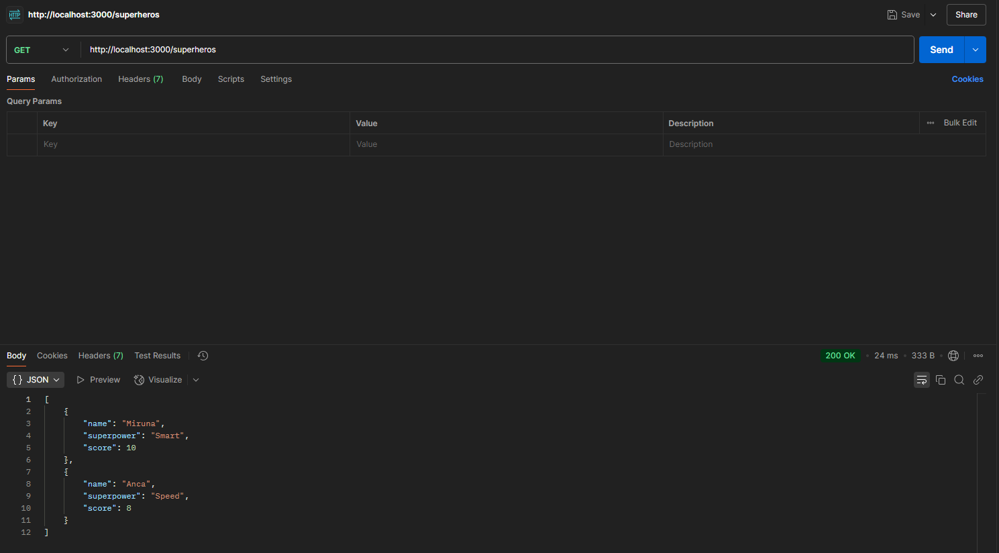
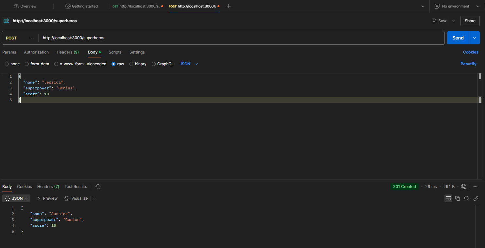
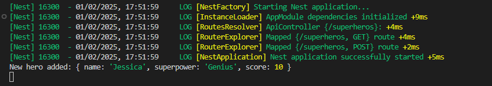
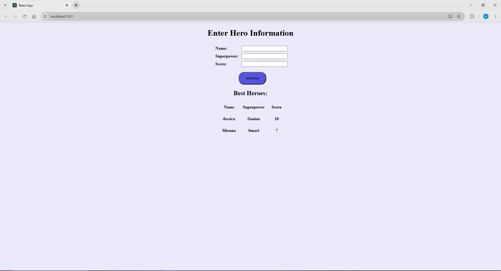

# Humble Superhero API

This project aims to allow users to add a hero (name, superpower and score) and see a list of heroes in order of highest score.

## Table of Contents
* [Technologies Used](#technologies-used)
* [Features](#features)
* [API Testing](#api-testing)
* [Frontend](#frontend)
* ["If I had more time"](#if-i-had-more-time)
* ["Task improvement"](#task-improvement)

## Technologies Used
- Node.js
- NestJS 
- Jest
- JavaScript
- React
- CSS

## Features
- Add a superhero with a name, superpower, and score. 
- Get the list of heroes sorted by score. 
- Validation to ensure the score is a number between 1 and 10 
- Jest test for 2 endpoints :  
The GET test ensures that a list of heroes is received and that it returns an array of heroes. 
The POST test ensures that a new hero can be added and that the response contains the correct details of the hero.
- React interface where users can add superheroes and see the sorted list in real-time.

## API testing 
The API were tested using Postamn 

## Frontend

## "If I had more time"
- More tests: 
POST /superheros - Score out of range - Ensure that an error is thrown when the score is out of range. 
POST /superheros - Invalid data types - Ensure that the server throws an error if the data types of the fields are incorrect.

- Type validation and error handling for properties (name, superpower and number) in both React (frontend) and NestJS (backend)

- Feedback for user after successful form submission

- Integration of a PostgreSQL/MySql database 

- Improvement of the frontend (background, table format, button, colors)

## "Task improvement"

### Score calculation
There would be a set of superpowers with a rating from 1 to 5 and each hero would be assigned a value for each superpower. Thus, the score would be calculated with a formula based on all superpowers. Also, the set of superpowers would be added as a property when a hero is created. For this case when users want to add a hero, they add the name and the value for each superpower(1 - 5). Exemple:

The set of superpowers and the hero(e.g. Jessica)
- creativity - 0/5
- rapidity  -  1/5
- empathy   - 2/5
- flexibility -3/5

Score formula = 3 x creativity + 3 x flexibility + 2 x empathy + 2 x rapidity (max score can be 50)

Jessica score = 3 x 0 + 3 x 3 + 2 x 2 + 2 x 1 = 15 

### Top 10 heroes
Order only the top 10 superheroes on the list by their score, in descending order.If they are more heroes with the same score they should be order alphabetically.

### Vote system 
Allow users to vote for the "Best Hero" 

Option 1: For this, there should be an input field where each user can write the name of their favorite superhero, and these will be counted.Based on the number of votes, the "best hero" should be displayed.

Option 2: Each of the top 10 heroes should have a "VOTE ME" button associated with it and users would just press the button to vote. These would be counted and based on the number of votes, the "best hero" should be displayed.

[Click here to view the api.controller.ts file](./task/src/api/api.controller.ts) 
[Click here to view the api.controller.spec file](./task/src/api/api.controller.spec.ts) 
[Click here to view the App.js file](./frontend/src/App.js) 
[Click here to view the App.css file](./frontend/src/App.css)

                               
